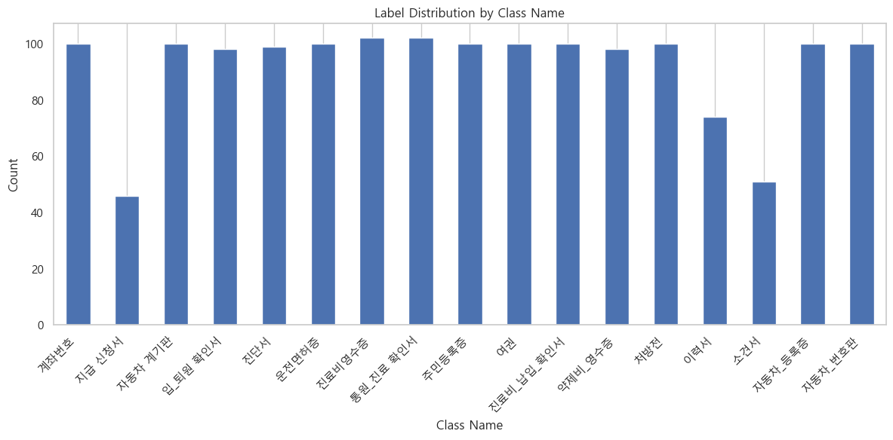
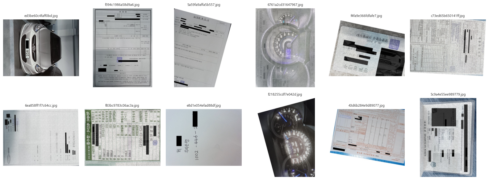
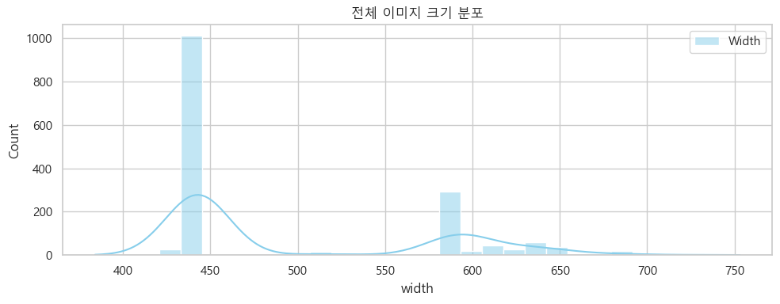
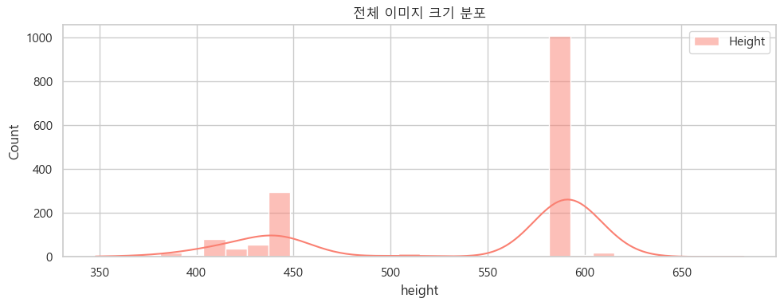
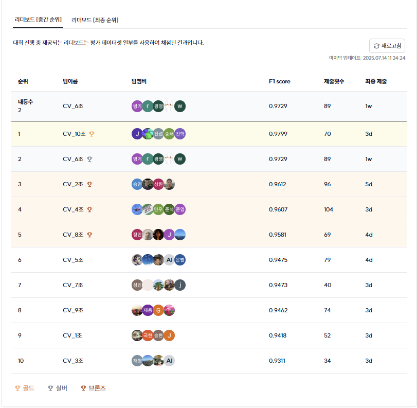
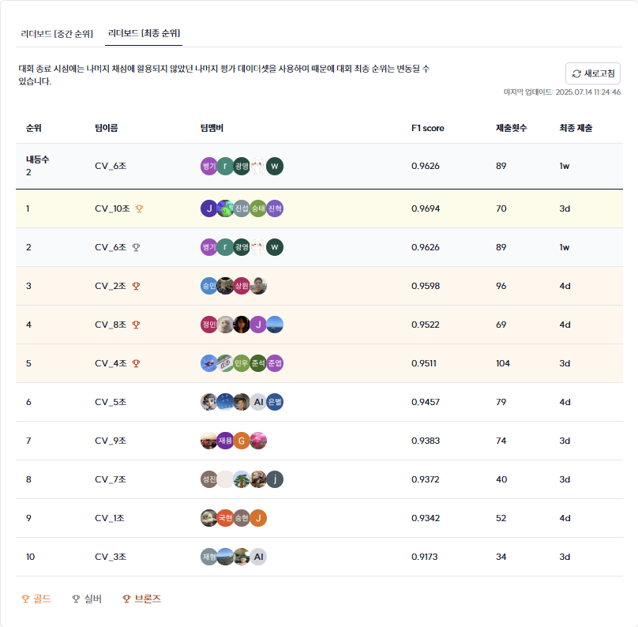

# Title (Please modify the title)
## Team

|  |  |  |  |  |
| :--------------------------------------------------------------: | :--------------------------------------------------------------: | :--------------------------------------------------------------: | :--------------------------------------------------------------: | :--------------------------------------------------------------: |
|            [김주형](https://github.com/UpstageAILab)             |            [김재훈](https://github.com/UpstageAILab)             |            [채병기](https://github.com/UpstageAILab)             |            [김문수](https://github.com/UpstageAILab)             |            [신광영](https://github.com/UpstageAILab)             |
|                            팀장, 담당 역할                             |                            담당 역할                             |                            담당 역할                             |                            담당 역할                             |                            담당 역할                             |

## 0. Overview
### Environment
- AMD Ryzen Threadripper 3960X 24-Core Processor
- NVIDIA GeForce RTX 3090 ram 24
- Colab A100 GPU ram 40

### Requirements
- matplotlib
- seaborn
- wandb
- dotenv
- augraphy
- pytorch-metric-learning

이외에 없는 것들은 ai-stage server 환경에 설치가 되어 있습니다.

## 1. Competiton Info

### Overview

- 이미지 분류 대회이며, 문서의 타입을 분류하는 문제입니다.

문서 데이터는 금융, 의료, 보험, 물류 등 산업 전반에 가장 많은 데이터이며, 많은 대기업에서 디지털 혁신을 위해 문서 유형을 분류하고자 합니다. 이러한 문서 타입 분류는 의료, 금융 등 여러 비즈니스 분야에서 대량의 문서 이미지를 식별하고 자동화 처리를 가능케 할 수 있습니다.

이번 대회에 사용될 데이터는 총 17개 종의 문서로 분류되어 있습니다. 1570장의 학습 이미지를 통해 3140장의 평가 이미지를 예측하게 됩니다. 특히, 현업에서 사용하는 실 데이터를 기반으로 대회를 제작하여 대회와 현업의 갭을 최대한 줄였습니다. 또한 현업에서 생길 수 있는 여러 문서 상태에 대한 이미지를 구축하였습니다.

### Timeline

- ex) June 30, 2025 - Start Date
- ex) July 11, 2025 - Final submission deadline

## 2. Components

### Directory

```
├── autoAugment
├── config
│   ├── config.py
│   ├── main_config.yaml
│   ├── transforms_config.yaml
└── datasets
│   ├── __init__.py
│   ├── FastImageDataset.py
│   ├── shack.py
│   ├── transforms.py
└── fonts
└── models
│   ├── __init__.py
│   ├── ArcMarginProduct.py
│   ├── ConvNeXt_head_arc_single.py
│   ├── Efficientnet_v2_b3_head_arc.py
│   ├── Efficientnet_v2_m_head_arc.py
│   ├── ResnetSt50_head_arc.py
└── trainer
│   ├── __init__.py
│   ├── evaluation.py
│   ├── train_loop.py
│   ├── training.py
│   ├── wandb_logger.py
│   ├── weighted_sampler.py
└── utils
│   ├── EarlyStopping.py
│   ├── loss_factory.py
│   ├── optimizer_factory.py
│   ├── scheduler_factory.py
│   ├── utils.py
│   ├── predict_tta.py
├── main.py
├── eda.ipynb
├── inference.ipynb
├── run_agent.sh
```

## 3. Data descrption

### Dataset overview

- 학습 데이터 1570개
- 평가 데이터 3140개

### EDA

- 클래스 분포 확인

- test 이미지 확인

- 이미지 크기 분포 분석



### Data Processing

- 이미지 라벨링 수정

38 약제비 영수증 -> 진료비영수증

192 소견서 -> 통원_진료 확인서

428 약제비 영수증 -> 진료비영수증

723 입_퇴원 확인서 -> 통원_진료 확인서

862 통원_진료 확인서 -> 입_퇴원 확인서

1095 입_퇴원 확인서 -> 소견서

1237 진단서 -> 소견서

## 4. Modeling

### Model descrition

- EfficientNetV2B3
- EfficientNetV2M
- ConvNeXt
- ResnetSt50

위 모델 위주로 사용 그리고 ArcFace head 붙여서 성능 강화

### Modeling Process


| 모델명                                                           | 적용 가설                                                                                                                                                                                                                           | f1     | 원인 분석                                                                       |
| ------------------------------------------------------------- | ------------------------------------------------------------------------------------------------------------------------------------------------------------------------------------------------------------------------------- | ------ | --------------------------------------------------------------------------- |
| EfficientNetV2B3ArcFaceModel_2025-07-04_02-46                 | 증강 기법 fix로 베이스라인 모델이라 할 수 있음                                                                                                                                                                                                    | 0.9277 |                                                                             |
| EfficientNetV2B3ArcFaceModel_2025-07-04_02-46                 | tta<br>RandomHorizontalFlip,<br>RandomRotation(10)<br>RandomRotation([-10, 10])                                                                                                                                                 | 0.9304 | tta 성능 좋았음!                                                                 |
| EfficientNetV2B3ArcFaceModel_2025-07-04_17-11                 | unfreeze 3 -> 4                                                                                                                                                                                                                 | 0.9449 | unfreeze 늘리니까 성능이 올라감                                                       |
| EfficientNetV2B3ArcFaceModel_2025-07-04_19-11                 | unfreeze 4 -> 5                                                                                                                                                                                                                 | 0.9316 | 하나 더 올려 봤는데 오히려 떨어짐                                                         |
| EfficientNetV2B3ArcFaceModel_2025-07-04_20-53                 | arcface margin 0.5 -> 0.55                                                                                                                                                                                                      | 0.9505 | margin 값 건드리니 점수가 많이 올라감                                                    |
| EfficientNetV2B3ArcFaceModel_2025-07-04_23-41                 | arcface margin 0.55 -> 0.6                                                                                                                                                                                                      | 0.9323 | 더 늘리니까 점수가 떨어짐                                                              |
| EfficientNetV2B3ArcFaceModel_2025-07-05_01-31                 | 클래스 불균형 문제 해결을 위해 FocalLoss 최초 적용                                                                                                                                                                                               | 0.9393 | 대 실패                                                                        |
| EfficientNetV2MArcFaceModel_2025-07-05_03-22                  | EfficientNetV2M 적용                                                                                                                                                                                                              | 0.9493 | 다시 소폭 상승                                                                    |
| EfficientNetV2MArcFaceModel_2025-07-05_05-20                  | CrossEntropyLoss 회귀해서 테스트                                                                                                                                                                                                       | 0.9427 | v2m 모델은 focalloss가 더 좋은 것으로 확인                                              |
| EfficientNetV2MArcFaceModel_2025-07-05_20-40                  | sampler 적용                                                                                                                                                                                                                      | 0.9518 | v2e3 보다 높은 점수를 획득                                                           |
| 2025.07.05 22:17 앙상블 테스트<br>                                  | EfficientNetV2B3ArcFaceModel_2025-07-04_20-53 모델과<br>EfficientNetV2MArcFaceModel_2025-07-05_20-40 모델의 앙상블                                                                                                                       | 0.9577 | 비슷한 모델이어도 앙상블 하면 효과적이라는 것을 깨달음                                              |
| 2025.07.05 22:38 EfficientNetV2MArcFaceModel_2025-07-05_20-40 | 테스트 데이터에 노이지 제거가 적용된 전처리 데이터로 인퍼런스 진행                                                                                                                                                                                           | 0.9534 | 노이즈 제거가 좋은 결과를 가져다 줌                                                        |
| 2025.07.05 22:42 앙상블 테스트                                      | 기존 앙상블에 테스트 데이터 전처리도 진행                                                                                                                                                                                                         | 0.9596 | 높은 점수 증가율을 보여줌                                                              |
| 2025.07.05 22:53 앙상블 3개 테스트                                   | EfficientNetV2B3ArcFaceModel_2025-07-04_20-53 모델과<br>EfficientNetV2MArcFaceModel_2025-07-05_20-40 모델과<br>ResNet50ArcFaceModel_2025-07-06_00-41 모델의 앙상블                                                                          | 0.9587 | 모델 하나가 안좋아서 그런지 점수가 소폭 감소                                                   |
| ResNeStModelArcFaceModel_2025-07-06_03-13                     | 지금까지와 동일한 하이퍼파라미터로 모델만 변경하여 학습                                                                                                                                                                                                  | 0.9572 | 굉장히 높은 점수가 나왔음                                                              |
| 2025.07.06 05:15 앙상블 3개                                       | EfficientNetV2B3ArcFaceModel_2025-07-04_20-53 모델과<br>EfficientNetV2MArcFaceModel_2025-07-05_20-40 모델과<br>ResNeStModelArcFaceModel_2025-07-06_03-13 모델의 앙상블                                                                      | 0.9592 | 단일 모델의 성능이 올라가니 앙상블 점수도 상승                                                  |
| 2025.07.06 05:21 앙상블 3개                                       | EfficientNetV2B3ArcFaceModel_2025-07-04_20-53 모델과<br>EfficientNetV2MArcFaceModel_2025-07-05_20-40 모델과<br>ResNeStModelArcFaceModel_2025-07-06_03-13 모델의 앙상블<br>비중 [0.2, 0.4, 0.4]                                                | 0.9634 | 비교적 성능이 낮은 모델에는 가중치를 낮게 주니까 점수가 더더욱 상승                                      |
| ConvNeXtArcFaceModel_2025-07-06_05-22                         | 지금까지와 동일한 하이퍼파라미터로 모델만 변경하여 학습                                                                                                                                                                                                  | 0.9609 | 단일 모델로 최고로 높은 모델                                                            |
| 2025.07.06 17:48 앙상블 3개                                       | EfficientNetV2MArcFaceModel_2025-07-05_20-40 모델과<br>ResNeStModelArcFaceModel_2025-07-06_03-13 모델과<br>ConvNeXtArcFaceModel_2025-07-06_05-22 모델의 앙상블<br>비중 [0.2, 0.4, 0.4]                                                        | 0.9729 | 최고 점수                                                                       |
| SwinTransformerArcFaceModel_2025-07-06_17-57                  | 지금까지와 동일한 하이퍼파라미터로 모델만 변경하여 학습                                                                                                                                                                                                  | 0.9424 | 학습 데이터가 부족해서 그런지 cnn 기반 모델보다 점수가 낮게 나옴                                      |
| 2025.07.06 19:47 앙상블 4개                                       | EfficientNetV2MArcFaceModel_2025-07-05_20-40 모델과<br>ResNeStModelArcFaceModel_2025-07-06_03-13 모델과<br>ConvNeXtArcFaceModel_2025-07-06_05-22 모델과 SwinTransformerArcFaceModel_2025-07-06_17-57 모델의 앙상블<br>[0.2, 0.3, 0.3, 0.2]<br> | 0.9688 | swin은 아예 다른걸 보는 모델이라 점수가 올라 갈거라고 생각했는데, 오히려 떨어짐<br>(이때 가중치를 다른거로 실험해봤어야 했음) |
| ResNeSt101eModelArcFaceModel_2025-07-07_11-27                 | 지금까지와 동일한 하이퍼파라미터로 모델만 변경하여 학습                                                                                                                                                                                                  | 0.9449 | 레이어를 늘리면 성능이 올라갈 것이라고 생각해서 테스트 해봤는데, 다른 파라미터를 줘야하는지 오히려 성능이 떨어짐             |
| sweep test 9번째 버전 ResNeSt50ArcFace 250708093749               | sweep 사용해서 최적에 파라미터를 찾는 테스트를 진행해 봄                                                                                                                                                                                              | 0.8970 | 더 많은 실험을 해봤어야 됐음                                                            |
| sweep-2 ConvNeXtArcFace                                       |                                                                                                                                                                                                                                 | 0.9153 | 계속했다면 올라갔을 수도?                                                              |


## 5. Result

### Leader Board

- Leader Board - 2st





### Presentation

[구글 슬라이드 링크](https://docs.google.com/presentation/d/1uh8z96gE8ikGF2z5TLbDFpdhYl8YJRCfvtdPLuxbD0w/edit?usp=sharing)

## etc

### Meeting Log

[대회 때 진행했던 협업들](https://www.notion.so/Document-Type-Classification-22f1367c4b178060835fd1bba381443e?source=copy_link)

### Reference

- 송원호 멘토님의 대회 가이드라인
